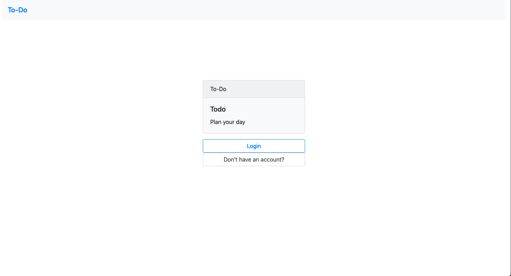

# ToDo: Plan your day

## Getting started

### Prerequisites

'''
alembic==1.3.1
Flask==1.1.1
Flask-Login==0.4.1
Flask-Migrate==2.5.2
Flask-SQLAlchemy==2.4.1
python-dotenv==0.10.3
SQLAlchemy==1.3.11
Werkzeug==0.16.0
'''
